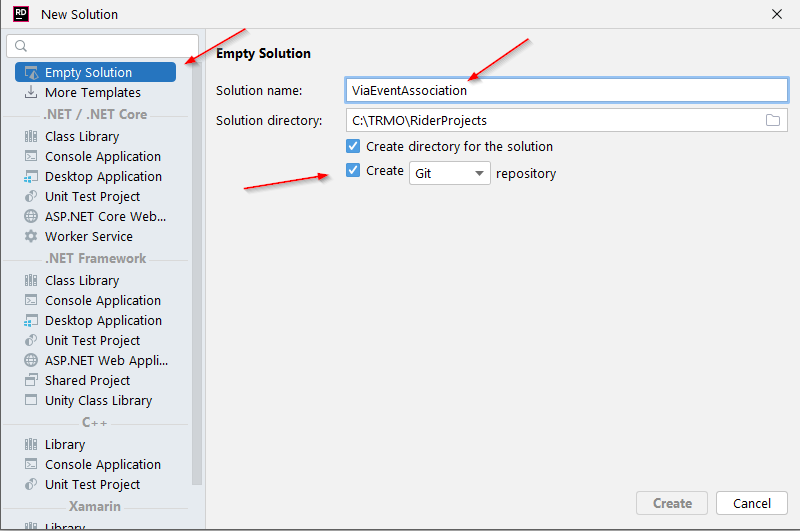

# Assignment 1
The purpose of this assignment is to set up the initial git repository and create a domain model of the project case.

All assignments will be handed in through git, and you must follow the structure described in the assignment documentations.

## Domain Model
In this folder you will find various documents describing the project case:
* [The description from the customer](Project%20description%20from%20customer.md), a textual description of the customer, and what they need.
* [The analysis artefacts](Project%20analysis%20artefacts.md), i.e. use cases
    
Based on this information you must create a domain model, it must be exported as an .svg file.

## Project setup
You will develop the project with .NET and C#. The first step is to create a new solution to set up your project. Put it under git version control, push it to GitHub, and share it with your group members, so that you can collaborate. The below will explain the steps.

So, only one member will do the below setup, and upload to git. Then the other group members can check-out the project, so that you can collaborate.

### 1. Create solution

Create a new empty .NET solution. Give it a name, and check the "create git repository" option.

The following screenshot is from Rider (spring 2023), but you may use whichever IDE you like. However, the solution structure must follow the guidelines given throughout the assignments.

### 2. New branch
Create a new git-branch, call it ”Assignment-1”.

You may create other branches as you see fit, but ”Assignment-1” is your hand-in branch. Consider it your main-branch for this first assignment. All your work from the first assignment must end up in this branch. Similarly for subsequent assignments.

### 3. New class library

Call this class library **”Documentation”**. This library will not contain any code, but instead various documentation files, such as diagrams, test cases, descriptions, etc. 

We put it in a class library, so that it is available in the ”solution view”. It is merely for convenience.

You may instead create just a directory, and put the same things in here, if you like. Other IDEs may show this better than Rider.

You may delete the dummy ”Class1.cs” file.

### 4. Create new directory

Inside your new Documentation class library create a folder, call it Assignment1.

In this folder, you will put whatever documentation is needed for the first assignment, i.e. probably just your domain model diagram as svg.

Shortly, the solution of assignment 1 will look like this:

### 5. Create markdown file.
Create a new markdown file:

In this file, you just put the names and student numbers of the group members.

### 6. Share
You can now upload the project to GitHub, invite your group-members to collaborate, and have them check out the project, so that you can work together.

## Your task
Based on the provided documentation (case description and use cases), create a domain model of VIA Event Association.

You are supposed to work in groups.

The assignment is handed in on itslearning, you just put in a link to the **Assignment-1 branch** on GitHub.

Deadline will be posted on itslearning. 